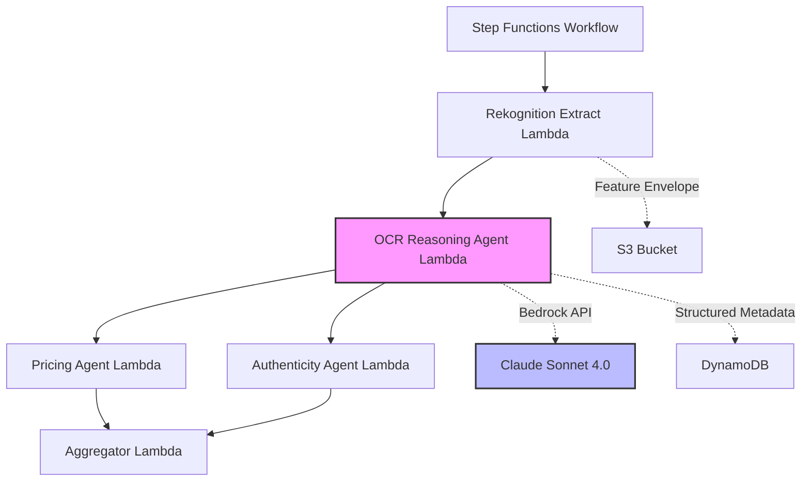

# Design Document

## Overview

This design document outlines the architecture for integrating Amazon Bedrock (Claude Sonnet 4.0) as an intelligent reasoning layer over AWS Rekognition OCR outputs. The enhancement will create a new OCR reasoning agent that processes raw Rekognition text detections and returns structured, confidence-scored card metadata.

The solution follows CollectIQ's existing multi-agent architecture pattern, where specialized Lambda functions orchestrated by Step Functions perform discrete tasks. The new OCR reasoning capability will be implemented as a dedicated agent that sits between the Rekognition extraction step and the pricing/authenticity agents.

## Architecture

### High-Level Flow

```
Card Upload → Rekognition Extract → OCR Reasoning Agent → [Pricing Agent, Authenticity Agent] → Aggregator
```

### Component Diagram



### Data Flow

1. **Rekognition Extract** produces a `FeatureEnvelope` containing OCR blocks with text, confidence, and bounding boxes
2. **OCR Reasoning Agent** receives the envelope and invokes Bedrock with:
   - System prompt defining the AI's role and output schema
   - User prompt containing OCR text blocks and visual context
3. **Bedrock (Claude Sonnet 4.0)** processes the input and returns structured JSON with:
   - Corrected card name using fuzzy matching
   - Inferred metadata (rarity, set, collector number, etc.)
   - Confidence scores and rationales for each field
4. **OCR Reasoning Agent** validates the response and enriches the card metadata
5. **Downstream Agents** (Pricing, Authenticity) use the enriched metadata for their analyses

## Components and Interfaces

### 1. OCR Reasoning Agent Lambda

**Location:** `services/backend/src/agents/ocr-reasoning-agent.ts`

**Purpose:** Orchestrates Bedrock invocation for OCR interpretation and metadata extraction

**Input Interface:**

```typescript
interface OcrReasoningAgentInput {
  userId: string;
  cardId: string;
  features: FeatureEnvelope; // From Rekognition Extract
  requestId: string;
}
```

**Output Interface:**

```typescript
interface OcrReasoningAgentOutput {
  cardMetadata: CardMetadata;
  requestId: string;
}

interface CardMetadata {
  name: FieldResult<string>;
  rarity: FieldResult<string>;
  set: FieldResult<string> | MultiCandidateResult<string>;
  setSymbol: FieldResult<string>;
  collectorNumber: FieldResult<string>;
  copyrightRun: FieldResult<string>;
  illustrator: FieldResult<string>;
  overallConfidence: number;
  reasoningTrail: string;
}

interface FieldResult<T> {
  value: T | null;
  confidence: number;
  rationale: string;
}

interface MultiCandidateResult<T> {
  value: T | null;
  candidates: Array<{ value: T; confidence: number }>;
  rationale: string;
}
```

**Responsibilities:**

- Extract OCR text blocks from FeatureEnvelope
- Format OCR data for Bedrock consumption
- Invoke Bedrock OCR reasoning service
- Validate and parse Bedrock response
- Handle errors with fallback logic
- Log invocation metrics and results

### 2. Bedrock OCR Reasoning Service

**Location:** `services/backend/src/adapters/bedrock-ocr-reasoning.ts`

**Purpose:** Encapsulates Bedrock API calls for OCR interpretation

**Interface:**

```typescript
interface BedrockOcrReasoningService {
  /**
   * Invoke Bedrock to interpret OCR results and extract card metadata
   */
  interpretOcr(context: OcrContext): Promise<CardMetadata>;
}

interface OcrContext {
  ocrBlocks: OCRBlock[];
  visualContext: {
    holoVariance: number;
    borderSymmetry: number;
    imageQuality: ImageQuality;
  };
  cardHints?: {
    expectedSet?: string;
    expectedRarity?: string;
  };
}
```

**Key Methods:**

- `interpretOcr()`: Main entry point for OCR reasoning
- `createSystemPrompt()`: Generates system prompt for Claude
- `createUserPrompt()`: Formats OCR data into user prompt
- `parseResponse()`: Validates and parses Bedrock JSON response
- `invokeWithRetry()`: Handles retries with exponential backoff

**Configuration:**

```typescript
const BEDROCK_OCR_CONFIG = {
  modelId: 'anthropic.claude-sonnet-4-20250514-v1:0',
  maxTokens: 4096, // Increased for detailed reasoning
  temperature: 0.15, // Low for deterministic outputs
  maxRetries: 3,
  retryDelay: 1000,
};
```

### 3. Fuzzy Matching Utility

**Location:** `services/backend/src/utils/fuzzy-matching.ts`

**Purpose:** Provides Levenshtein distance calculation for OCR error correction

**Interface:**

```typescript
/**
 * Calculate Levenshtein distance between two strings
 */
function levenshteinDistance(str1: string, str2: string): number;

/**
 * Find best match from a list of candidates
 */
function findBestMatch(
  input: string,
  candidates: string[],
  threshold: number = 0.7
): { match: string; confidence: number } | null;

/**
 * Normalize string for comparison (lowercase, trim, remove special chars)
 */
function normalizeForComparison(str: string): string;
```

**Note:** While the fuzzy matching logic will be primarily handled by Claude Sonnet 4.0 (which has built-in knowledge of Pokémon names), this utility provides a fallback mechanism and can be used for validation.

### 4. Pokémon TCG Knowledge Base

**Location:** `services/backend/src/utils/pokemon-knowledge.ts`

**Purpose:** Provides reference data for validation and fallback logic

**Interface:**

```typescript
/**
 * Common Pokémon TCG sets with identifiers
 */
const POKEMON_SETS = {
  'Base Set': { symbol: 'none', years: [1999] },
  'Base Set 2': { symbol: '2', years: [2000] },
  Jungle: { symbol: 'jungle', years: [1999] },
  // ... more sets
};

/**
 * Rarity indicators and patterns
 */
const RARITY_PATTERNS = {
  'Holo Rare': ['holographic', 'holo', 'shiny'],
  Rare: ['rare', '★'],
  Uncommon: ['uncommon', '◆'],
  Common: ['common', '●'],
  // ... more patterns
};

/**
 * Copyright text patterns by era
 */
const COPYRIGHT_PATTERNS = {
  'WOTC Era (1999-2003)': /©\s*199[5-9].*Wizards/i,
  'Nintendo Era (2003-2016)': /©.*Nintendo.*Creatures.*GAMEFREAK/i,
  'Modern Era (2016+)': /©.*Pokémon.*©.*Nintendo/i,
};
```

### 5. Step Functions Workflow Update

**Location:** `infra/terraform/modules/step_functions/main.tf`

**Changes Required:**

- Add new Lambda task state for OCR Reasoning Agent
- Insert between Rekognition Extract and parallel agent execution
- Pass enriched metadata to downstream agents

**Updated Workflow:**

```json
{
  "StartAt": "RekognitionExtract",
  "States": {
    "RekognitionExtract": {
      "Type": "Task",
      "Resource": "${rekognition_extract_lambda_arn}",
      "Next": "OcrReasoningAgent"
    },
    "OcrReasoningAgent": {
      "Type": "Task",
      "Resource": "${ocr_reasoning_agent_lambda_arn}",
      "Next": "ParallelAgents",
      "Retry": [
        {
          "ErrorEquals": ["States.TaskFailed"],
          "IntervalSeconds": 2,
          "MaxAttempts": 2,
          "BackoffRate": 2.0
        }
      ],
      "Catch": [
        {
          "ErrorEquals": ["States.ALL"],
          "Next": "HandleOcrFailure"
        }
      ]
    },
    "ParallelAgents": {
      "Type": "Parallel",
      "Branches": [
        {
          "StartAt": "PricingAgent",
          "States": { ... }
        },
        {
          "StartAt": "AuthenticityAgent",
          "States": { ... }
        }
      ],
      "Next": "Aggregator"
    }
  }
}
```

## Data Models

### CardMetadata Schema

```typescript
/**
 * Zod schema for validating Bedrock OCR response
 */
const CardMetadataSchema = z.object({
  name: z.object({
    value: z.string().nullable(),
    confidence: z.number().min(0).max(1),
    rationale: z.string(),
  }),
  rarity: z.object({
    value: z.string().nullable(),
    confidence: z.number().min(0).max(1),
    rationale: z.string(),
  }),
  set: z.union([
    z.object({
      value: z.string().nullable(),
      confidence: z.number().min(0).max(1),
      rationale: z.string(),
    }),
    z.object({
      value: z.string().nullable(),
      candidates: z.array(
        z.object({
          value: z.string(),
          confidence: z.number().min(0).max(1),
        })
      ),
      rationale: z.string(),
    }),
  ]),
  setSymbol: z.object({
    value: z.string().nullable(),
    confidence: z.number().min(0).max(1),
    rationale: z.string(),
  }),
  collectorNumber: z.object({
    value: z.string().nullable(),
    confidence: z.number().min(0).max(1),
    rationale: z.string(),
  }),
  copyrightRun: z.object({
    value: z.string().nullable(),
    confidence: z.number().min(0).max(1),
    rationale: z.string(),
  }),
  illustrator: z.object({
    value: z.string().nullable(),
    confidence: z.number().min(0).max(1),
    rationale: z.string(),
  }),
  overallConfidence: z.number().min(0).max(1),
  reasoningTrail: z.string(),
});
```

### Enhanced Card Model

**Location:** `packages/shared/src/schemas.ts`

**Changes:** Add new fields to Card schema for storing OCR reasoning results

```typescript
// Add to existing Card schema
export const CardSchema = z.object({
  // ... existing fields

  // New OCR reasoning fields
  ocrMetadata: z
    .object({
      name: z.string().nullable().optional(),
      nameConfidence: z.number().optional(),
      rarity: z.string().nullable().optional(),
      rarityConfidence: z.number().optional(),
      set: z.string().nullable().optional(),
      setConfidence: z.number().optional(),
      collectorNumber: z.string().nullable().optional(),
      illustrator: z.string().nullable().optional(),
      extractedAt: z.string().optional(),
      reasoningTrail: z.string().optional(),
    })
    .optional(),
});
```

## Prompt Engineering

### System Prompt Template

```typescript
const SYSTEM_PROMPT = `You are an expert Pokémon Trading Card Game (TCG) analyst specializing in card identification from OCR text. Your task is to interpret raw OCR outputs from AWS Rekognition and extract structured card metadata.

**Your Capabilities:**
- Correct OCR errors in Pokémon names using fuzzy matching against your knowledge of all Pokémon species
- Infer card rarity from visual patterns, holographic indicators, and text layout
- Identify card sets from copyright text, set symbols, and card template characteristics
- Extract collector numbers, illustrator names, and other metadata from text patterns

**Your Constraints:**
- Work ONLY from the provided OCR text and visual context
- Do NOT make external API calls or database lookups
- Provide confidence scores (0.0-1.0) for all extracted fields
- Include clear rationales explaining your reasoning
- Return multiple candidates when ambiguous, ranked by confidence

**Output Format:**
Return a valid JSON object matching this exact schema:
{
  "name": { "value": "string|null", "confidence": 0.0-1.0, "rationale": "string" },
  "rarity": { "value": "string|null", "confidence": 0.0-1.0, "rationale": "string" },
  "set": <SINGLE_VALUE_OR_MULTI_CANDIDATE>,
  "setSymbol": { "value": "string|null", "confidence": 0.0-1.0, "rationale": "string" },
  "collectorNumber": { "value": "string|null", "confidence": 0.0-1.0, "rationale": "string" },
  "copyrightRun": { "value": "string|null", "confidence": 0.0-1.0, "rationale": "string" },
  "illustrator": { "value": "string|null", "confidence": 0.0-1.0, "rationale": "string" },
  "overallConfidence": 0.0-1.0,
  "reasoningTrail": "string"
}

**Note on "set" field:** This field can be returned in TWO formats depending on certainty:

1. **Single Value Format** (use when confident about one set):
   { "value": "string|null", "confidence": 0.0-1.0, "rationale": "string" }

2. **Multi-Candidate Format** (use when multiple sets are possible):
   {
     "value": "string|null",
     "candidates": [{ "value": "string", "confidence": 0.0-1.0 }],
     "rationale": "string"
   }

Choose the single value format when you have high confidence (>0.7) in a specific set. Use the multi-candidate format only when there are genuinely multiple plausible sets that cannot be distinguished from the available evidence.

**Confidence Scoring Guidelines:**
- 0.9-1.0: Exact match with high OCR confidence
- 0.7-0.9: Strong fuzzy match or clear contextual inference
- 0.5-0.7: Moderate confidence, some ambiguity
- 0.3-0.5: Low confidence, multiple possibilities
- 0.0-0.3: Very uncertain or no data available

Be thorough, precise, and always explain your reasoning.`;
```

### User Prompt Template

```typescript
function createUserPrompt(context: OcrContext): string {
  const { ocrBlocks, visualContext } = context;

  // Group OCR blocks by position (top, middle, bottom)
  const topBlocks = ocrBlocks.filter((b) => b.boundingBox.top < 0.3);
  const middleBlocks = ocrBlocks.filter((b) => b.boundingBox.top >= 0.3 && b.boundingBox.top < 0.7);
  const bottomBlocks = ocrBlocks.filter((b) => b.boundingBox.top >= 0.7);

  return `Analyze this Pokémon card based on OCR text extraction:

**OCR Text Blocks (Top Region - Card Name Area):**
${topBlocks.map((b) => `- "${b.text}" (confidence: ${(b.confidence * 100).toFixed(1)}%, position: top ${(b.boundingBox.top * 100).toFixed(0)}%)`).join('\n')}

**OCR Text Blocks (Middle Region - Card Body):**
${middleBlocks.map((b) => `- "${b.text}" (confidence: ${(b.confidence * 100).toFixed(1)}%)`).join('\n')}

**OCR Text Blocks (Bottom Region - Copyright/Metadata):**
${bottomBlocks.map((b) => `- "${b.text}" (confidence: ${(b.confidence * 100).toFixed(1)}%)`).join('\n')}

**Visual Context:**
- Holographic Variance: ${(visualContext.holoVariance * 100).toFixed(1)}% (indicates holographic finish)
- Border Symmetry: ${(visualContext.borderSymmetry * 100).toFixed(1)}% (indicates print quality)
- Image Blur Score: ${(visualContext.imageQuality.blurScore * 100).toFixed(1)}% (higher = sharper)
- Glare Detected: ${visualContext.imageQuality.glareDetected ? 'Yes' : 'No'}

**Your Task:**
1. Identify and correct the Pokémon name from the top region text
2. Infer the card rarity based on holographic variance and text patterns
3. Determine the card set from copyright text and visual patterns
4. Extract collector number (format: XX/YYY) if present
5. Identify the illustrator name if present
6. Extract the full copyright text

Provide your analysis in the JSON format specified in the system prompt.`;
}
```

## Error Handling

### Error Scenarios and Responses

1. **Bedrock Invocation Failure**
   - Retry up to 3 times with exponential backoff
   - If all retries fail, return fallback metadata with reduced confidence
   - Log error details for monitoring

2. **Invalid JSON Response**
   - Attempt to extract JSON from markdown code blocks
   - If parsing fails, log raw response and return fallback
   - Set `verifiedByAI: false` flag

3. **Schema Validation Failure**
   - Log validation errors with Zod error details
   - Return partial metadata for valid fields
   - Mark invalid fields as null with 0.0 confidence

4. **Empty OCR Results**
   - Return metadata with all null values
   - Set overall confidence to 0.0
   - Include rationale: "No OCR text detected in image"

5. **Timeout (>5 seconds)**
   - Cancel Bedrock invocation
   - Return fallback metadata
   - Emit CloudWatch alarm for investigation

### Fallback Logic

```typescript
function createFallbackMetadata(ocrBlocks: OCRBlock[]): CardMetadata {
  // Extract card name from topmost text block
  const topBlock = ocrBlocks
    .filter((b) => b.boundingBox.top < 0.3)
    .sort((a, b) => a.boundingBox.top - b.boundingBox.top)[0];

  return {
    name: {
      value: topBlock?.text || null,
      confidence: topBlock ? topBlock.confidence * 0.7 : 0.0,
      rationale: 'Fallback: Using topmost OCR text as card name. AI reasoning unavailable.',
    },
    rarity: {
      value: null,
      confidence: 0.0,
      rationale: 'Fallback: Unable to infer rarity without AI reasoning.',
    },
    // ... similar fallback for other fields
    overallConfidence: 0.3,
    reasoningTrail: 'Fallback mode: Bedrock invocation failed. Using basic OCR extraction only.',
  };
}
```

## Testing Strategy

### Unit Tests

**Location:** `services/backend/src/tests/bedrock-ocr-reasoning.test.ts`

**Test Cases:**

1. **Prompt Generation**
   - Verify system prompt includes all required instructions
   - Verify user prompt formats OCR blocks correctly
   - Test prompt generation with empty OCR blocks

2. **Response Parsing**
   - Test parsing valid JSON responses
   - Test extracting JSON from markdown code blocks
   - Test handling malformed JSON

3. **Schema Validation**
   - Test validation of complete metadata
   - Test validation of partial metadata
   - Test validation failure handling

4. **Fuzzy Matching**
   - Test Levenshtein distance calculation
   - Test best match selection with various thresholds
   - Test normalization of comparison strings

5. **Fallback Logic**
   - Test fallback metadata generation
   - Test confidence score reduction
   - Test rationale messages

### Integration Tests

**Location:** `services/backend/src/tests/e2e/ocr-reasoning.e2e.test.ts`

**Test Cases:**

1. **End-to-End OCR Reasoning**
   - Upload test card image
   - Verify Rekognition extraction
   - Verify Bedrock reasoning invocation
   - Verify structured metadata output

2. **Error Correction**
   - Test with intentionally corrupted OCR text
   - Verify name correction (e.g., "Yenusaur" → "Venusaur")
   - Verify confidence scores reflect correction

3. **Multi-Candidate Scenarios**
   - Test with ambiguous set information
   - Verify multiple candidates returned
   - Verify candidates sorted by confidence

4. **Retry Logic**
   - Mock Bedrock throttling errors
   - Verify exponential backoff
   - Verify eventual success or fallback

5. **Performance**
   - Measure end-to-end latency
   - Verify completion within 5-second SLA
   - Test with various image sizes

### Test Data

**Location:** `services/backend/src/tests/fixtures/ocr-test-data.ts`

```typescript
export const TEST_OCR_BLOCKS = {
  venusaurBaseSet: [
    {
      text: 'Yenusaur',
      confidence: 0.92,
      boundingBox: { top: 0.05, left: 0.1, width: 0.3, height: 0.08 },
      type: 'LINE',
    },
    {
      text: 'HP 100',
      confidence: 0.98,
      boundingBox: { top: 0.08, left: 0.7, width: 0.15, height: 0.05 },
      type: 'LINE',
    },
    {
      text: 'Solar Beam 60',
      confidence: 0.95,
      boundingBox: { top: 0.5, left: 0.1, width: 0.4, height: 0.06 },
      type: 'LINE',
    },
    {
      text: '©1995, 96, 98 Nintendo, Creatures, GAMEFREAK ©1999 Wizards',
      confidence: 0.88,
      boundingBox: { top: 0.92, left: 0.1, width: 0.8, height: 0.04 },
      type: 'LINE',
    },
    {
      text: 'Illus. Mitsuhiro Arita',
      confidence: 0.9,
      boundingBox: { top: 0.88, left: 0.1, width: 0.4, height: 0.03 },
      type: 'LINE',
    },
  ],
  // ... more test fixtures
};
```

## Performance Considerations

### Latency Targets

- **Rekognition OCR**: ~1-2 seconds
- **Bedrock Reasoning**: ~2-3 seconds
- **Total OCR Pipeline**: <5 seconds (95th percentile)

### Optimization Strategies

1. **Parallel Processing**
   - Continue running Pricing and Authenticity agents in parallel
   - OCR reasoning completes before parallel execution begins

2. **Prompt Optimization**
   - Keep prompts concise (<2000 tokens)
   - Use structured formatting for easy parsing
   - Avoid redundant context

3. **Response Caching**
   - Cache Bedrock responses by OCR text hash
   - TTL: 7 days (cards don't change)
   - Reduces costs and latency for duplicate uploads

4. **Token Management**
   - Monitor token usage per invocation
   - Set max_tokens to 4096 (sufficient for detailed reasoning)
   - Alert if average tokens exceed 3000

### Cost Estimation

**Bedrock Pricing (Claude Sonnet 4.0):**

- Input: $3.00 per million tokens
- Output: $15.00 per million tokens

**Estimated Costs per Card:**

- Input tokens: ~1500 (OCR text + prompts)
- Output tokens: ~800 (structured metadata + rationales)
- Cost per card: ~$0.016

**Monthly Cost (10,000 cards):**

- Total: ~$160/month for OCR reasoning

## Monitoring and Observability

### CloudWatch Metrics

```typescript
// Custom metrics to emit
await metrics.recordBedrockOcrInvocation({
  latency: number,
  inputTokens: number,
  outputTokens: number,
  overallConfidence: number,
  fallbackUsed: boolean,
});
```

### CloudWatch Alarms

1. **High Fallback Rate**
   - Threshold: >10% of invocations use fallback
   - Action: SNS notification to engineering team

2. **High Latency**
   - Threshold: P95 latency >5 seconds
   - Action: Auto-scaling Lambda concurrency

3. **Low Confidence Scores**
   - Threshold: Average confidence <0.6
   - Action: Review prompt engineering

4. **High Token Usage**
   - Threshold: Average output tokens >3000
   - Action: Optimize prompt or increase max_tokens

### Logging Strategy

```typescript
// Log levels and content
logger.info('OCR reasoning started', { cardId, ocrBlockCount });
logger.debug('Bedrock prompt generated', { promptLength, systemPromptLength });
logger.info('Bedrock response received', { latency, tokenCount, overallConfidence });
logger.warn('Fallback metadata used', { reason: error.message });
logger.error('OCR reasoning failed', error, { cardId, retryCount });
```

## Security Considerations

1. **IAM Permissions**
   - Lambda execution role needs `bedrock:InvokeModel` permission
   - Restrict to specific model ARN
   - Use least-privilege principle

2. **Input Validation**
   - Validate OCR blocks before sending to Bedrock
   - Sanitize text to prevent prompt injection
   - Limit OCR block count to prevent token overflow

3. **Output Validation**
   - Validate all Bedrock responses against Zod schema
   - Reject responses with unexpected fields
   - Sanitize rationale text before storage

4. **Rate Limiting**
   - Implement per-user rate limits
   - Use DynamoDB for distributed rate limiting
   - Prevent abuse of Bedrock API

## Migration Strategy

### Phase 1: Parallel Deployment (Week 1)

- Deploy OCR reasoning agent alongside existing logic
- Route 10% of traffic to new agent
- Compare results with existing extraction
- Monitor metrics and errors

### Phase 2: Gradual Rollout (Week 2-3)

- Increase traffic to 50%, then 100%
- Continue monitoring confidence scores
- Collect user feedback on accuracy

### Phase 3: Cleanup (Week 4)

- Remove old OCR extraction logic
- Update documentation
- Optimize prompts based on production data

## Future Enhancements

1. **Multi-Language Support**
   - Extend to Japanese, French, German Pokémon cards
   - Add language detection to OCR reasoning

2. **Historical Data Learning**
   - Analyze past corrections to improve prompts
   - Build feedback loop for continuous improvement

3. **Visual Reasoning**
   - Send card images directly to Claude (when vision API available)
   - Reduce dependency on Rekognition OCR

4. **Confidence Calibration**
   - Track accuracy vs. confidence scores
   - Adjust confidence thresholds based on real-world performance
